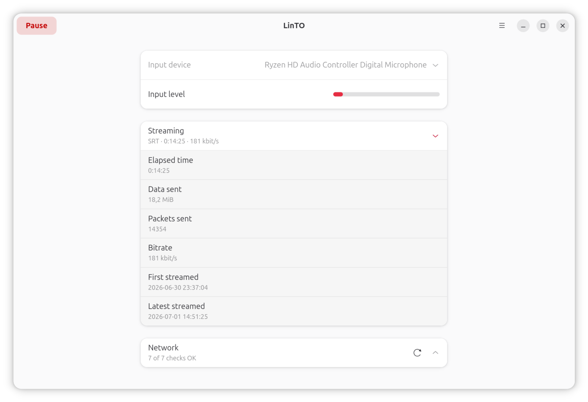

<p align="center">
  
</p>

# gnome-linto

A GNOME client for [linto.ai](https://linto.ai). The app captures a local audio
input and sends it to a LinTO Studio server over SRT for live transcription and
translation.

<p align="center">
  
</p>

- Language: Vala
- Platform: GNOME 49 (GTK 4 + libadwaita)
- Media: GStreamer with a native PipeWire source
- Packaging: Flatpak
- License: AGPL-3.0-or-later

## Install

Download and install the latest release in one line:

```
curl -L -o /tmp/gnome-linto-0.1.2-x86_64.flatpak https://github.com/benjaminbellamy/gnome-linto/releases/download/v0.1.2/gnome-linto-0.1.2-x86_64.flatpak && flatpak install --user /tmp/gnome-linto-0.1.2-x86_64.flatpak
```

Then run it:

```
flatpak run ai.linto.gnomelinto
```

## Build and run (Flatpak)

```
flatpak-builder --user --install --force-clean build-dir ai.linto.gnomelinto.yaml
flatpak run ai.linto.gnomelinto
```

## Build and run (Meson)

```
meson setup builddir
ninja -C builddir
```

## Features

- Select a PipeWire audio input and watch a live VU meter.
- Pre-flight network checks (adapter, local and public IP, internet, and the
  LinTO server reachability).
- Stream to a LinTO Studio SRT endpoint, with automatic reconnection if the
  link drops.
- Live transport statistics (elapsed time, data sent, packets, bitrate), saved
  per URL with first and latest streaming timestamps.
- Remote control from a Stream Deck through the companion
  [gnome-linto-streamcontroller](https://github.com/benjaminbellamy/gnome-linto-streamcontroller)
  plugin for [Stream Controller](https://github.com/StreamController/StreamController):
  a built-in control server lets the button start and pause streaming and show
  live status.

## License

This project is licensed under the GNU Affero General Public License v3.0 or
later. See [LICENSE](LICENSE).
